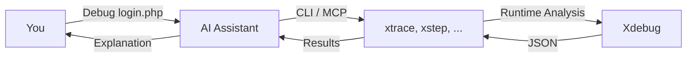

# Xdebug MCP


**Debug PHP with Natural Language — No var_dump(), No Guesswork**

AI-powered PHP debugging tools using Xdebug's runtime analysis. Works with Claude Code (plugin), Cursor, Windsurf (MCP), and CLI.

[](https://github.com/koriym/xdebug-mcp)
[](https://github.com/koriym/xdebug-mcp)
[-NO-red)](https://github.com/koriym/xdebug-mcp)

---

## Natural Language Debugging

Just tell your AI assistant what you want:

**English:**
```text
"Debug script.php and find why $user is null at line 42"
"Profile api.php and find the performance bottleneck"
"Trace the authentication flow in login.php"
"Check test coverage for UserService"
```

**日本語:**
```text
"script.phpをデバッグして、42行目で$userがnullになる原因を調べて"
"api.phpのパフォーマンスボトルネックを見つけて"
"login.phpの認証フローをトレースして"
"UserServiceのテストカバレッジを確認して"
```

The AI automatically selects the appropriate tool, executes it, and analyzes the results.

## Requirements

- PHP 8.1+
- [Xdebug 3.x](https://xdebug.org/docs/install) extension (installed, but **not** enabled by default)
- AI assistant: Claude Code (plugin), Cursor/Windsurf (MCP), or CLI

> **💡 Performance Tip:** Keep Xdebug disabled in php.ini for daily use. This tool loads Xdebug on-demand only when needed.

## Quick Start

### 1. Install

```bash
composer global require koriym/xdebug-mcp
```

### 2. Verify Xdebug

```bash
~/.composer/vendor/bin/check-env
```

### 3. Setup AI Integration

**Claude Code:**
```text
/plugin marketplace add koriym/xdebug-mcp
/plugin install xdebug@xdebug-mcp
```

**Cursor / Windsurf:** See [MCP Configuration](#mcp-configuration) below.

### 4. Restart your AI assistant and try it

```text
# Download demo files
git clone --depth 1 https://github.com/koriym/xdebug-mcp.git /tmp/xdebug-demo

# Ask Claude to debug
"Debug /tmp/xdebug-demo/demo/buggy.php and find the bugs"
```

Or use the skill directly:
```text
/xdebug
```

## Try CLI Tools

Run the demo examples to see each tool in action:

```bash
# Debug buggy code with breakpoints (JSON output)
./bin/xstep --break="demo/buggy.php:22" -- php demo/buggy.php

# Trace execution flow
./bin/xtrace --context="Debug demo" -- php demo/buggy.php

# Profile performance bottlenecks
./bin/xprofile --json -- php demo/slow.php

# Analyze code coverage
./bin/xcoverage -- php demo/coverage.php

# Get stack trace at breakpoint
./bin/xback --break="demo/buggy.php:44" -- php demo/buggy.php
```

Each command outputs structured JSON data that AI can analyze to provide debugging insights.

## How It Works



**No var_dump(). No code modification. No guesswork.**

## Available Tools

| Tool | Purpose | Example Prompt |
|------|---------|----------------|
| `xstep` | Breakpoint debugging, variable inspection | "Stop at line 42 and show me the variables" |
| `xtrace` | Execution flow analysis | "Trace how the request flows through the app" |
| `xprofile` | Performance profiling | "Find what's making this endpoint slow" |
| `xcoverage` | Code coverage analysis | "Which lines aren't covered by tests?" |
| `xback` | Call stack at breakpoint | "Show me how we got to this error" |

## CLI Usage

For direct command-line usage without AI:

```bash
# Trace execution
xtrace -- php script.php

# Profile performance
xprofile -- php api.php

# Debug with conditional breakpoint
xstep --break='script.php:42:$user==null' --exit-on-break -- php script.php

# Code coverage
xcoverage -- vendor/bin/phpunit

# Stack trace at breakpoint
xback --break='app.php:50' -- php app.php
```

Run `--help` on any tool for detailed options.

## MCP Configuration

For Cursor, Windsurf, and other MCP-compatible tools.

Create `.mcp.json` in your project root:

```json
{
  "mcpServers": {
    "xdebug": {
      "command": "php",
      "args": ["/Users/YOUR_USERNAME/.composer/vendor/bin/xdebug-mcp"]
    }
  }
}
```

Find the correct path: `which xdebug-mcp`

## Interactive REPL

For hands-on debugging without AI, use the interactive debugger:

```bash
xstep --break="script.php:42" -- php script.php
```

**Commands:**

| Command | Description |
|---------|-------------|
| `s` | Step into function |
| `o` | Step over line |
| `out` | Step out of function |
| `c` | Continue execution |
| `p <var>` | Print variable (e.g., `p $user`) |
| `bt` | Show backtrace |
| `l` | List source code |
| `q` | Quit debugger |

## Docker Support

All tools work with Docker, Podman, and Kubectl:

```bash
xstep --break="/app/script.php:42" --exit-on-break -- \
  docker compose run --rm php php /app/script.php

xtrace -- docker compose run --rm php php /app/script.php
```

The tools automatically detect container runtime and configure Xdebug networking.

See [tests/docker/README.md](tests/docker/README.md) for details.

## Debugging Legacy PHP (7.x / 5.x)

While xdebug-mcp itself requires PHP 8.1+, it can debug older PHP versions as long as a compatible Xdebug 3.x release is installed on the target PHP. Simply specify the target PHP binary after `--`:

```bash
# Debug PHP 7.2 code
xtrace -- /opt/homebrew/opt/php@7.2/bin/php legacy_app.php
xprofile -- /opt/homebrew/opt/php@7.2/bin/php legacy_app.php
xstep --break="legacy_app.php:30" -- /opt/homebrew/opt/php@7.2/bin/php legacy_app.php
```

The tool runs on your modern PHP while the target script executes on the specified PHP binary — provided the specified PHP has a compatible Xdebug 3.x installed. No Docker required. Check the compatibility table below before trying older PHP binaries.

### Xdebug 3.x Compatibility

| Xdebug | Supported PHP |
| -------- | --------------- |
| 3.0-3.1 | PHP 5.4 - 8.0 |
| 3.2 | PHP 5.6 - 8.3 |
| 3.3 | PHP 7.0 - 8.4 |
| 3.4 | PHP 7.4 - 8.5 |

See [Xdebug compatibility](https://xdebug.org/docs/compat) for details.

## For Developers

See [tests/ai/README.md](tests/ai/README.md) for tool discoverability testing.

## AI Native Design

This tool is designed specifically for AI consumption, not adapted from human interfaces.

| Debugger for Humans | AI Native (this tool) |
|---------------------|----------------------|
| Step-by-step interaction | One-shot batch execution |
| Session management required | Stateless CLI |
| Multiple tool calls | Single command, complete data |
| Manual log placement | Automatic full trace |

**Why it matters:**
- **Fewer tokens**: One command returns all data vs. many back-and-forth calls
- **No session errors**: Stateless design eliminates timeout/connection issues
- **Comprehensive data**: `xtrace` captures everything; AI filters what it needs

## See Also

Looking for a different approach? [kpanuragh/xdebug-mcp](https://github.com/kpanuragh/xdebug-mcp) offers 41 MCP tools with session-based interactive debugging — ideal if you prefer step-by-step control.

## Why "xdebug-mcp"?

This project started as an MCP (Model Context Protocol) server for AI-powered PHP debugging. While MCP remains supported for tools like Cursor and Windsurf, we now recommend the **plugin approach** for Claude Code users — it's simpler and requires no MCP configuration.

The CLI tools (`xstep`, `xtrace`, `xprofile`, `xcoverage`, `xback`) work independently of both MCP and plugins.

## Resources

- [Troubleshooting](https://koriym.github.io/xdebug-mcp/TROUBLESHOOTING) - Setup issues
- [Forward Trace Guide](https://koriym.github.io/xdebug-mcp/debug-guidelines/) - AI debugging methodology
- [llms.txt](https://koriym.github.io/xdebug-mcp/llms.txt) - LLM-readable documentation
- [Motivation](MOTIVATION.md) - Why we built this
- [Xdebug Docs](https://xdebug.org/docs/) - Official documentation

---

**Stop debugging blind. Just ask your AI.**
