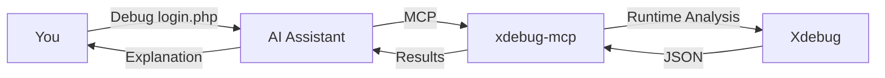

# PHP Xdebug MCP Server


**Debug PHP with Natural Language — No var_dump(), No Guesswork**

An [MCP (Model Context Protocol)](https://modelcontextprotocol.io/) server that enables AI assistants to debug PHP using Xdebug's runtime analysis.

[](https://github.com/koriym/xdebug-mcp)
[](https://github.com/koriym/xdebug-mcp)
[-NO-red)](https://github.com/koriym/xdebug-mcp)

---

## Natural Language Debugging

Just tell your AI assistant what you want:

**English:**
```
"Debug script.php and find why $user is null at line 42"
"Profile api.php and find the performance bottleneck"
"Trace the authentication flow in login.php"
"Check test coverage for UserService"
```

**日本語:**
```
"script.phpをデバッグして、42行目で$userがnullになる原因を調べて"
"api.phpのパフォーマンスボトルネックを見つけて"
"login.phpの認証フローをトレースして"
"UserServiceのテストカバレッジを確認して"
```

The AI automatically selects the appropriate tool, executes it, and analyzes the results.

## Requirements

- PHP 8.0+
- [Xdebug 3.x](https://xdebug.org/docs/install) extension (installed, but **not** enabled by default)
- MCP-compatible AI assistant (Claude Code, etc.)

> **💡 Performance Tip:** Keep Xdebug disabled in php.ini for daily use. This tool loads Xdebug on-demand only when needed.

## Quick Start

```bash
# 1. Install
composer global require koriym/xdebug-mcp

# 2. Verify Xdebug is available (even if disabled in php.ini)
~/.composer/vendor/bin/check-env

# 3. Configure your AI assistant's MCP settings
#    For Claude Code, edit: ~/.claude.json
{
  "mcpServers": {
    "xdebug": {
      "command": "php",
      "args": ["~/.composer/vendor/bin/xdebug-mcp"],
      "env": {
        "PATH": "/opt/homebrew/bin:/usr/local/bin:/usr/bin:/bin"
      }
    }
  }
}

# 4. Restart your AI assistant
```

Now ask your AI to debug PHP code.

## How It Works



**No var_dump(). No code modification. No guesswork.**

## MCP Tools

| Tool | Purpose | Example Prompt |
|------|---------|----------------|
| `xstep` | Breakpoint debugging, variable inspection | "Stop at line 42 and show me the variables" |
| `xtrace` | Execution flow analysis | "Trace how the request flows through the app" |
| `xprofile` | Performance profiling | "Find what's making this endpoint slow" |
| `xcoverage` | Code coverage analysis | "Which lines aren't covered by tests?" |
| `xback` | Call stack at breakpoint | "Show me how we got to this error" |

## CLI Usage

For direct command-line usage without AI:

```bash
# Trace execution
xtrace -- php script.php

# Profile performance
xprofile -- php api.php

# Debug with conditional breakpoint
xstep --break='script.php:42:$user==null' --exit-on-break -- php script.php

# Code coverage
xcoverage -- vendor/bin/phpunit

# Stack trace at breakpoint
xback --break='app.php:50' -- php app.php

# Analyze trace files
xanalyze trace.xt --summary
```

Run `--help` on any tool for detailed options.

## Interactive REPL

For hands-on debugging without AI, use the interactive debugger:

```bash
xstep -- php script.php
```

**Commands:**

| Command | Description |
|---------|-------------|
| `s` | Step into function |
| `o` | Step over line |
| `out` | Step out of function |
| `c` | Continue execution |
| `p <var>` | Print variable (e.g., `p $user`) |
| `bt` | Show backtrace |
| `l` | List source code |
| `q` | Quit debugger |

## Docker Support

All tools work with Docker, Podman, and Kubectl:

```bash
xstep --break="/app/script.php:42" --exit-on-break -- \
  docker compose run --rm php php /app/script.php

xtrace -- docker compose run --rm php php /app/script.php
```

The tools automatically detect container runtime and configure Xdebug networking.

See [tests/docker/README.md](tests/docker/README.md) for details.

## Resources

- [Troubleshooting](https://koriym.github.io/xdebug-mcp/TROUBLESHOOTING) - Setup issues
- [Forward Trace Guide](https://koriym.github.io/xdebug-mcp/debug-guidelines/) - AI debugging methodology
- [Motivation](MOTIVATION.md) - Why we built this
- [Xdebug Docs](https://xdebug.org/docs/) - Official documentation

---

**Stop debugging blind. Just ask your AI.**
